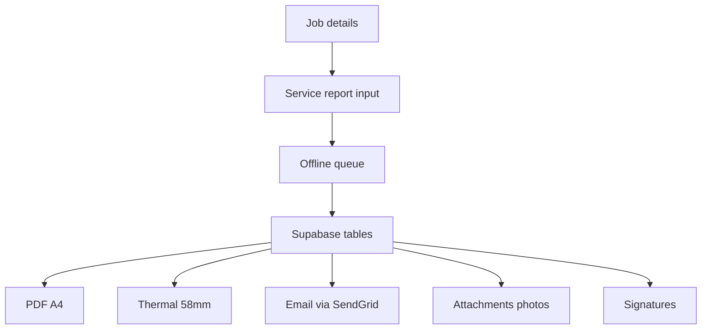

# Job Order Management System - TODO

Last updated: 2025-10-22 17:18 UTC+8

Status legend: [x] completed | [-] in progress | [ ] pending

Scope decisions (locked)
- Multi-tenant: Multi-company org isolation with branches
- Auth: Email/password + Google OAuth; clients self-register
- Output: PDF A4 and 58mm thermal receipts; email via SendGrid
- Platforms: Android API 23+, iOS 12+; English; camera scanning only
- Currency and taxes: PHP en_PH; VAT 12 percent; partial payments allowed
- Region: ap-southeast-1

Next up
- [ ] Provision Supabase projects for dev and prod and retrieve keys
- [ ] Configure Supabase Auth providers email+Google and test login
- [ ] Create organizations, organization_users, and branches tables
- [ ] Add org_id and branch_id to domain tables with RLS isolation
- [ ] Create service_reports table and numbering generator SR-YYYYMM-####
- [ ] Seed problem_causes and job_tasks lookups from form
- [ ] Configure SendGrid domain/auth and env variables

Architecture overview

Full backlog
- [x] Confirm remaining scope decisions for Supabase variant rollout including tenancy model single or multi, auth providers to enable, receipt printing requirement now or later, minimum Android and iOS versions, branding and localization
- [ ] Provision Supabase projects for dev and prod in ap-southeast-1 and retrieve anon and service keys with environment secrets
- [ ] Configure Supabase Auth providers enable email password and Google OAuth set redirect URLs and test login
- [ ] Create organizations table with name slug country currency timezone and metadata
- [ ] Create organization_users table linking users to organizations with org_role enum owner admin staff technician client and status
- [ ] Create branches table linked to organizations with name address contact and active flag
- [ ] Add org_id and optional branch_id to all domain tables user_profiles job_orders job_order_assignments job_status_history job_items estimates estimate_items invoices invoice_items payments inventory tables attachments messages schedules time_entries signatures event_log and service_reports
- [ ] Update all RLS policies to enforce strict organization isolation by org_id and role based permissions including Client limited to own and Technician limited to assigned
- [ ] Define Postgres enums for org_role job_status estimate_status invoice_status payment_method payment_status device_type problem_cause job_performed_task and signature_role
- [ ] Create user_profiles table linked to auth users with org_id branch_id role display_name phone and timestamps
- [ ] Create job_orders table with org_id branch_id client_id created_by status scheduled_at location description and financial_totals
- [ ] Create job_order_assignments table mapping technicians and staff to jobs with roles and time windows
- [ ] Create job_status_history table recording status transitions timestamps actor and notes
- [ ] Create job_items table for billable services and parts attached to a job with qty unit_price discount tax and currency PHP
- [ ] Create estimates table linked to job with totals tax discounts validity and approval fields
- [ ] Create estimate_items table with line items pricing and tax
- [ ] Create invoices table with totals tax discounts due_date balance status and links to job or estimate currency PHP allow partial payments
- [ ] Create invoice_items table mirroring estimate_items with final amounts
- [ ] Create payments table supporting cash and bank transfer initially include method amount currency PHP reference and status
- [x] Decision required select online card gateway for Philippines Stripe Xendit PayMongo or None update backlog accordingly
- [ ] Create inventory_items table with org_id branch_id sku barcode name category cost price stock reorder_level and active flag currency PHP
- [ ] Create inventory_stock_movements table for adjustments issues returns and purchases with qty reason and user
- [ ] Create attachments table storing storage_path file_type size uploader and job or record reference
- [ ] Create messages table for client staff technician communications scoped to job with read flags
- [ ] Create schedules table for job scheduling and technician assignment time slots
- [ ] Create time_entries table for technician time tracking per job with start end and duration
- [ ] Create signatures table for digital signatures linked to jobs invoices and service_reports with storage_path and signer info
- [ ] Create event_log table for auditable system events and notification audit trail
- [ ] Add foreign keys indexes and constraints for all new tables including composite indexes on common filters and org_id branch_id combinations
- [ ] Seed reference data for default statuses service categories default currency PHP and initial roles and pipelines
- [ ] Implement RLS for inventory tables read for Staff and Admin limited or none for Client
- [ ] Implement RLS for billing tables estimates invoices payments per role with client read own only
- [ ] Implement RLS for attachments restricting read write to job participants and admins
- [ ] Implement RLS for messages restricting visibility to job participants and admins
- [ ] Implement RLS for schedules and time_entries limited to assigned technicians staff and admins
- [ ] Create Postgres triggers to maintain invoice totals job financial summaries and stock adjustments
- [ ] Implement Supabase Edge function to send push via OneSignal REST with app and auth secrets
- [ ] Implement Supabase Edge function to send transactional email via SendGrid API for estimate issued approved invoice issued receipt
- [ ] Create logic to invoke OneSignal and SendGrid notifications on job assignment status changes estimate approved and invoice issued
- [ ] Implement Supabase Edge function to create Stripe payment intents for card payments if gateway chosen
- [ ] Implement Supabase Edge function for Stripe webhooks to confirm payments and update records if gateway chosen
- [ ] Secure all Edge functions with secrets org checks and CORS document environment variables
- [ ] Initialize Flutter project and add packages supabase_flutter riverpod or bloc go_router one_signal_sdk mobile_scanner image_compression flutter_pdf printing bluetooth_print or alternative csv localization intl
- [ ] Configure environment handling for dev and prod for Supabase OneSignal and SendGrid keys
- [ ] Update platform build settings Android minSdkVersion 23 and iOS deployment target 12 and ensure Bluetooth permissions
- [ ] Implement app navigation shell with role based route guards and deep linking including multi org context switching
- [ ] Implement authentication screens login register reset and session persistence with profile bootstrap and Google OAuth
- [ ] Add 1-click login button for admin access in development environment
- [ ] Implement client self registration flow with org join code and optional branch selection
- [ ] Implement profile bootstrap flow to capture role specific fields on first login and bind to org and branch
- [ ] Select local persistence for offline Isar or Drift and set up baseline schema
- [ ] Implement offline mutation queue with retry backoff and deduplication for technician flows
- [ ] Implement conflict handling last write wins plus merge for notes and time entries
- [ ] Implement image compression pipeline target longest side 1600px quality 70 and staged upload to storage
- [ ] Integrate barcode scanning using mobile_scanner and parse EAN and QR codes for inventory
- [ ] Build Admin dashboard with metrics job pipeline revenue and inventory usage scoped by org and branch
- [ ] Build Admin user management to create edit delete users assign org roles and manage branches
- [ ] Build Admin reports center with filters and export to PDF and CSV
- [ ] Build Admin system settings for tax currency PHP service rates discount rules notification settings and company branding
- [ ] Build Staff create job order form with client selection branch location description and attachments
- [ ] Build Staff assign technician and schedule with calendar view and conflict checks
- [ ] Build Staff job progress tracking and status updates workflow
- [ ] Build Staff client communications chat per job with push and email triggers
- [ ] Build Staff estimate creation conversion to invoice and approval workflow
- [ ] Build Staff billing module with itemized breakdown tax discounts partial payments and real time totals in PHP
- [ ] Build Staff payment processing Cash and Bank Transfer record reference numbers and receipts
- [ ] Build Client submit job request with attachments and contact info bind to org via join code
- [ ] Build Client job status and history screens with filters
- [ ] Build Client notifications center and deep link handling to job and estimate detail
- [ ] Build Client estimate review and approval screen with email confirmations
- [ ] Build Client invoices list and payment history screens
- [ ] Build Technician assigned jobs list with offline availability and quick filters
- [ ] Build Technician job detail view with status updates and progress notes
- [ ] Build Technician photo capture for before during after with multiple images and metadata
- [ ] Build Technician time tracking start pause resume and complete with offline support
- [ ] Build Technician mark job completed and capture client signature
- [ ] Build Inventory items CRUD with stock levels cost price and categories
- [ ] Build Inventory scanning to add parts to a job via barcode and validate stock
- [ ] Build Inventory stock movement screens and automatic decrement on job items
- [ ] Build Inventory CSV import and export tooling
- [ ] Implement global search for job orders with full text and field filters
- [ ] Implement filters by status date range technician client and branch across job lists
- [ ] Implement in app calendar views for staff and technician scheduling day week month
- [ ] Integrate OneSignal push handling in app and route to relevant screens
- [ ] Implement PDF generation for estimates invoices receipts and service reports with company branding
- [ ] Implement CSV export for jobs invoices and inventory usage
- [ ] Implement access logs and audit trail write entries to event_log for critical actions
- [ ] Add form validation error handling empty and loading states across the app
- [ ] Write unit tests for billing calculations inventory adjustments RLS policy checks and service report mapping
- [ ] Write integration tests for repositories offline sync and multi tenant RLS against Supabase test project
- [ ] Prepare UAT scripts covering Admin Staff Client and Technician workflows service report capture and printing
- [ ] Add app theming branding colors logos and icons
- [ ] Prepare Play Store and App Store listings app identifiers and build configurations for Android 23+ and iOS 12+
- [ ] Performance pass on list virtualization image caching pagination and query indexing
- [ ] Security pass on RLS policies token lifecycle secrets storage transport encryption and org isolation
- [ ] Launch v1 and create backlog for v1.1 features iOS Bluetooth 58mm support enhanced printing GPS tracking and signature enhancements
- [x] Design service report data model mapping from attached form including reference_no date_received date_released customer contact address branch device_type serial_number problem_reported issue_resolved recommendation and associations
- [ ] Enumerate problem causes from form as problem_cause enum and create service_report_causes join per report
- [ ] Enumerate job performed tasks from form desktop laptop and printer sections as job_performed_task enum and create service_report_tasks with result pass fail good bad ok not_ok
- [ ] Implement service report parts and service fee table mapping to job_items and invoice_items
- [ ] Build technician and staff UI to input the service report with checklists notes tests results and photos
- [ ] Generate branded PDF of service report matching the form layout including signatures and embedded photos thumbnails
- [ ] Implement 58mm thermal print templates for service report summary and receipt using ESC POS with character width constraints
- [ ] Implement Bluetooth 58mm printing on Android test with common ESC POS printer model and handle reconnection
- [ ] For iOS provide fallback via PDF share AirPrint and evaluate feasible BLE plugin support add as backlog if blocked
- [x] Confirm PH VAT default rate 12 percent or custom set in system settings and update billing calculations and reports accordingly
- [ ] Implement service report numbering generator SR-YYYYMM-#### with concurrency safe sequence and monthly reset
- [ ] Configure SendGrid domain authentication and default from address set env variables SENDGRID_API_KEY SENDGRID_FROM SENDGRID_DOMAIN
- [ ] Replace problem_cause and job_performed_task enums with lookup tables problem_causes and job_tasks seeded from attached form to allow future updates without migrations update RLS and references
- [ ] Calibrate 58mm ESC POS formatting including code page handling for peso symbol fallback to PHP text and line width 32 chars typical
- [ ] Set locale and currency formatting to en_PH with ₱ symbol across UI PDFs receipts and reports
- [ ] Enable barcode scan option to capture device serial number in service report header when present
- [ ] Create service_reports table with fields org_id branch_id job_id reference_no customer fields device fields problem_reported other_troubleshooting issue_resolved recommendation totals_currency created_by technician created_at updated_at
- [ ] Create RLS policies for service_reports enforcing org isolation and role based visibility Admin and Staff all Technicians assigned Clients own jobs only
- [ ] Add report_id column to job_items and backfill mapping from service reports
- [ ] Add attachments linkage to service_reports and indexes on record_type record_id
- [ ] Add composite indexes to service_reports on org_id branch_id reference_no and job_id
- [ ] Seed problem_causes and job_tasks lookup tables with deduplicated codes and labels from the form